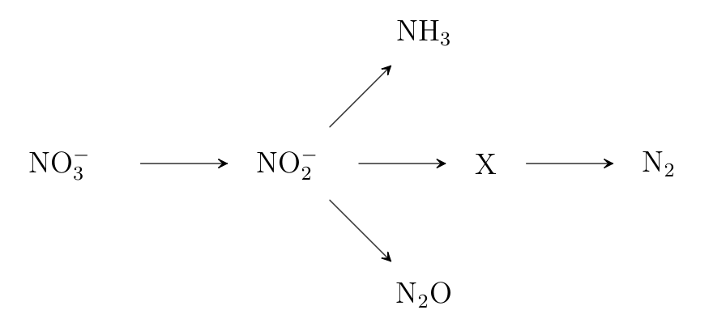
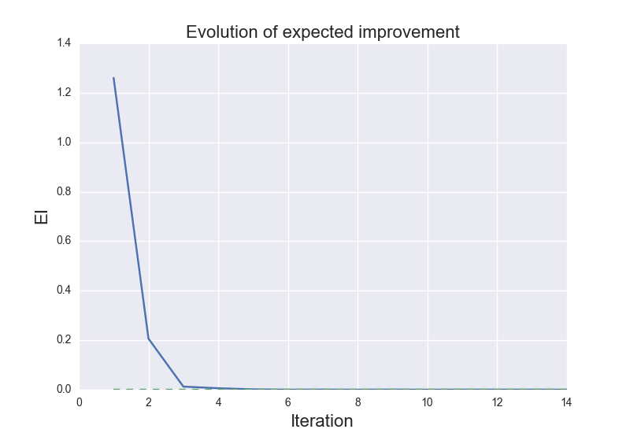
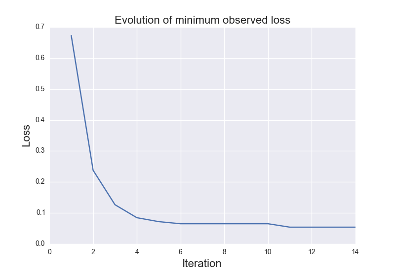
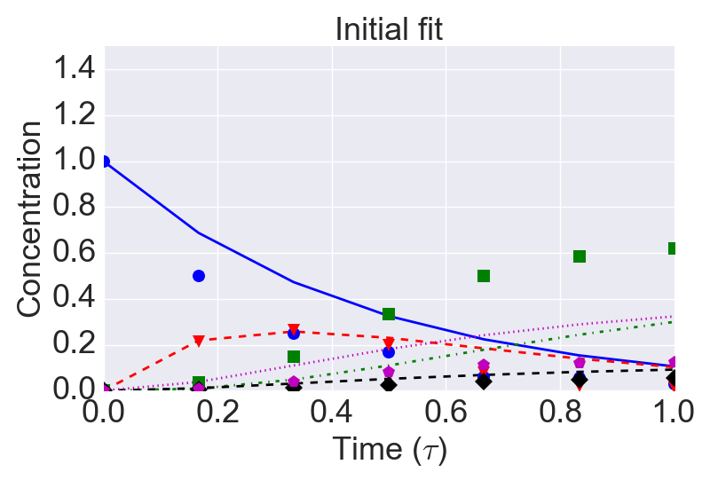
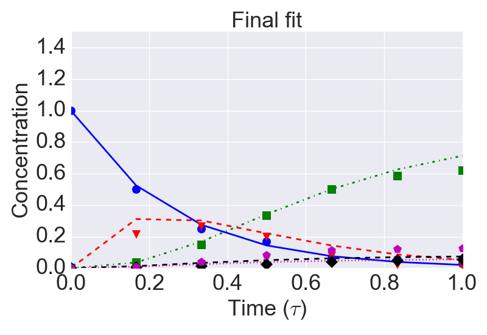

Use Bayesian Global Optimization to Solve Inverse Problems
======================================================================

This package contains examples of application of Bayesian Global Optimization
(BGO) to the solution of inverse problems.

The code is developed by the
[Predictive Science Laboratory (PSL)](http://www.predictivesciencelab.org) at
Purdue University.

Contents
--------

We give a brief description of what is in each file/folder of this code.
For more details, you are advised to look at the extensive comments.

* [plots.py](./plots.py):
Includes routines that make the plots you see.

* [pydes](./pydes):
This is a Python module that implements BGO.
It will be a separate fully functional module in the near future.

Dependencies
------------

Before trying to use the code, you should install the following dependencies:
* [matplotlib](http://matplotlib.org)
* [seaborn](http://stanford.edu/~mwaskom/software/seaborn/)
* [GPy](https://github.com/SheffieldML/GPy)

Installation
------------

There is nothing to install. You can just use the code once you enter the code
directory. [pydes](./pydes) can be used as an independent python module if you
add it to your PYTHONPATH. However, this is not necessary if all you want to
do is run the demos.

Runnings the demos
------------------

The demo is in [solve_inverse.py](./solve_inverse.py) which can be run as a 
common Python script.
The demo calibrates the following catalysis model:

using this [data](./catalysis_data.txt) kindly provided by
[Dr. Ioannis Katsounaros](http://casc.lic.leidenuniv.nl/people/katsounaros).
The details of the model are explained in example 1 of our 
[paper](http://arxiv.org/abs/1410.5522).
Contrary to the paper, here we pose the inverse problem as a minimization of
a loss function:

The notation has the following meaning:
* x: parameters that need calibrating
* f(x): forward model
* y: experimental data (presumably predicted by f(x))
* L(x, y): loss function

The scripts produces detailed output of the BGO, and it creates the following
figures:
* [results/ei.png](./results/ei.png):
Maximum of expected improvement at each iteration of the algorithm.

* [results/loss.png](./results/loss.png):
Minimum observed loss function at each iteration of the BGO.

* [results/init_fit.png](./results/init_fit.png):
The initial fit to the data.

* [results/final_fit.png](./results/final_fit.png):
The final fit to the data.

